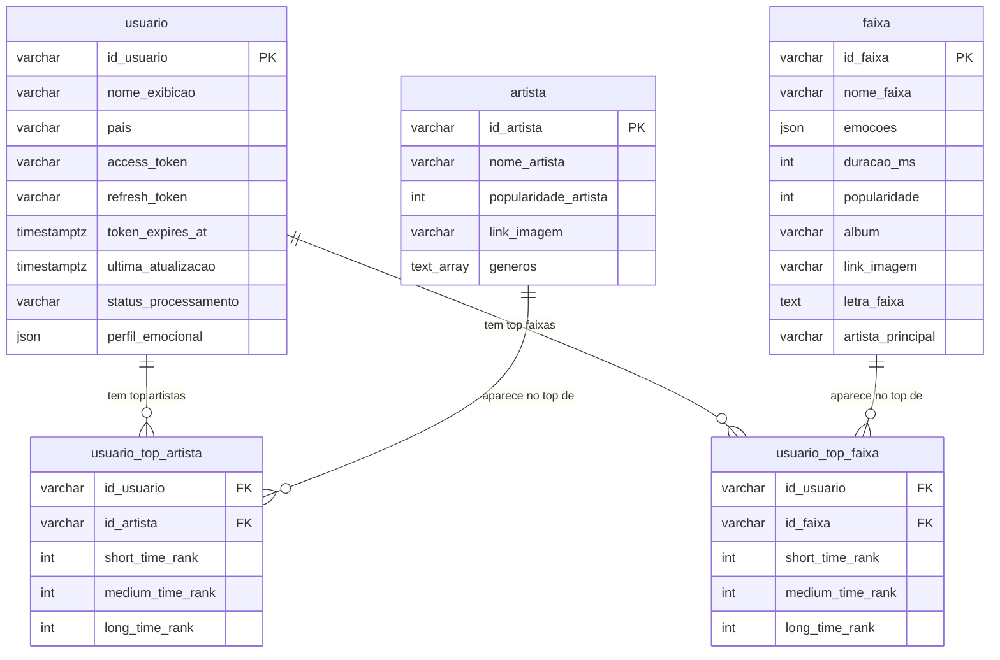

# 🗄️ Documentação do Banco de Dados

Banco de dados relacional PostgreSQL gerenciado via **SQLModel** + **SQLAlchemy (async)**.

---

## Diagrama de Relacionamentos (ERD)

---

## Tabelas

### `usuario`

Armazena os dados de cada usuário autenticado via Spotify OAuth.

| Coluna | Tipo | Restrições | Descrição |
|---|---|---|---|
| `id_usuario` | `VARCHAR(50)` | **PK** | ID do usuário no Spotify |
| `nome_exibicao` | `VARCHAR(50)` | NOT NULL | Nome de exibição no Spotify |
| `pais` | `VARCHAR(50)` | NOT NULL | País da conta Spotify |
| `access_token` | `VARCHAR(512)` | NOT NULL | Token de acesso OAuth atual |
| `refresh_token` | `VARCHAR(1024)` | NOT NULL | Token de renovação OAuth |
| `token_expires_at` | `TIMESTAMPTZ` | nullable | Data/hora de expiração do access token |
| `ultima_atualizacao` | `TIMESTAMPTZ` | nullable | Última vez que os dados foram sincronizados |
| `status_processamento` | `VARCHAR(512)` | nullable | Status da ingestão de dados em background |
| `perfil_emocional` | `JSON` | nullable | Resultado da análise emocional gerada por IA |

> **Fonte:** [`app/models/usuario.py`](../app/models/usuario.py)

---

### `artista`

Catálogo de artistas coletados a partir dos tops dos usuários.

| Coluna | Tipo | Restrições | Descrição |
|---|---|---|---|
| `id_artista` | `VARCHAR(50)` | **PK** | ID do artista no Spotify |
| `nome_artista` | `VARCHAR(50)` | NOT NULL | Nome do artista |
| `popularidade_artista` | `INTEGER` | NOT NULL | Score de popularidade (0–100) do Spotify |
| `link_imagem` | `VARCHAR(250)` | NOT NULL | URL da imagem/foto do artista |
| `generos` | `TEXT[]` | NOT NULL | Array PostgreSQL com os gêneros musicais do artista |

> **Fonte:** [`app/models/artista.py`](../app/models/artista.py)

---

### `faixa`

Catálogo de faixas (músicas) coletadas a partir dos tops dos usuários.

| Coluna | Tipo | Restrições | Descrição |
|---|---|---|---|
| `id_faixa` | `VARCHAR(50)` | **PK** | ID da faixa no Spotify |
| `nome_faixa` | `VARCHAR(255)` | NOT NULL | Nome da música |
| `artista_principal` | `VARCHAR(255)` | NOT NULL | Nome do artista principal da faixa |
| `album` | `VARCHAR(255)` | NOT NULL | Nome do álbum |
| `duracao_ms` | `INTEGER` | NOT NULL | Duração da faixa em milissegundos |
| `popularidade` | `INTEGER` | NOT NULL | Score de popularidade (0–100) do Spotify |
| `link_imagem` | `VARCHAR(255)` | NOT NULL | URL da capa do álbum |
| `letra_faixa` | `TEXT` | nullable | Letra da música (coletada via Genius API) |
| `emocoes` | `JSON` | nullable | Mapa de emoções detectadas por IA. Ex: `{"alegria": 0.8, "tristeza": 0.1}` |

> **Fonte:** [`app/models/faixa.py`](../app/models/faixa.py)

---

### `usuario_top_artista`

Tabela de junção (N:N) entre `usuario` e `artista`. Armazena o ranking do artista para cada janela de tempo.

| Coluna | Tipo | Restrições | Descrição |
|---|---|---|---|
| `id_usuario` | `VARCHAR(50)` | **PK**, FK → `usuario.id_usuario` | Referência ao usuário |
| `id_artista` | `VARCHAR(50)` | **PK**, FK → `artista.id_artista` | Referência ao artista |
| `short_time_rank` | `INTEGER` | nullable | Posição no top das últimas **4 semanas** |
| `medium_time_rank` | `INTEGER` | nullable | Posição no top dos últimos **6 meses** |
| `long_time_rank` | `INTEGER` | nullable | Posição no top de **todos os tempos** |

> A chave primária composta `(id_usuario, id_artista)` garante unicidade por par usuário–artista.

> **Fonte:** [`app/models/usuario_top_artista.py`](../app/models/usuario_top_artista.py)

---

### `usuario_top_faixa`

Tabela de junção (N:N) entre `usuario` e `faixa`. Armazena o ranking da faixa para cada janela de tempo.

| Coluna | Tipo | Restrições | Descrição |
|---|---|---|---|
| `id_usuario` | `VARCHAR(50)` | **PK**, FK → `usuario.id_usuario` | Referência ao usuário |
| `id_faixa` | `VARCHAR(50)` | **PK**, FK → `faixa.id_faixa` | Referência à faixa |
| `short_time_rank` | `INTEGER` | nullable | Posição no top das últimas **4 semanas** |
| `medium_time_rank` | `INTEGER` | nullable | Posição no top dos últimos **6 meses** |
| `long_time_rank` | `INTEGER` | nullable | Posição no top de **todos os tempos** |

> A chave primária composta `(id_usuario, id_faixa)` garante unicidade por par usuário–faixa.

> **Fonte:** [`app/models/usuario_top_faixa.py`](../app/models/usuario_top_faixa.py)

---

## Notas

- A coluna `emocoes` na tabela `faixa` é populada de forma assíncrona por um pipeline de IA (Groq/AWS Bedrock) após a ingestão inicial.
- O campo `perfil_emocional` em `usuario` é gerado a partir da agregação das emoções de todas as suas top faixas.
- Os rankings (`short_time_rank`, `medium_time_rank`, `long_time_rank`) correspondem aos períodos da API do Spotify: `short_term`, `medium_term` e `long_term`, respectivamente.
- O banco é inicializado automaticamente no startup via `init_db()` em [`app/core/database.py`](../app/core/database.py).
